<p align="center">
  <h1 align="center">📡 数据对接平台</h1>
  <p align="center">
    <strong>配置化 · 可视化 · 高扩展</strong> 的企业级数据同步解决方案
  </p>
  <p align="center">
    
    
    
    
    
  </p>
</p>

---

## 📖 项目简介

**数据对接平台**是一款面向企业数据集成场景的配置化 ETL 工具，通过可视化界面即可完成异构数据源之间的数据同步任务配置与执行，**零代码**实现数据抽取（Extract）、转换（Transform）、加载（Load）全流程。

### 核心价值

- **降低数据集成门槛** — 无需编写复杂的同步脚本，通过 Web 界面配置即可完成任务
- **异构数据源互通** — 支持 MySQL、Oracle、PostgreSQL、SQL Server、达梦、人大金仓等主流数据库及 API 连接器
- **灵活的 ETL 管线** — 内置数据清洗函数链、Groovy 脚本转换、字典映射等能力，满足复杂转换需求
- **多目标同步** — 单源数据可同时推送至多个目标表/库，支持差异化字段映射
- **生产级可靠性** — 内置熔断器、监控告警、执行日志、数据血缘追踪等运维能力

---

## ✨ 功能特性

| 模块 | 能力 |
|------|------|
| 🔌 **连接器管理** | 支持 MySQL / Oracle / PostgreSQL / SQL Server / 达梦 / 人大金仓 / API 等多种数据源，一键测试连接 |
| 📋 **任务管理** | 全量 / 增量同步模式，Cron 定时调度，Webhook 触发，任务复制与草稿保存 |
| 🎯 **多目标同步** | 单任务支持多个目标端配置，每个目标独立字段映射与写入策略（INSERT / UPDATE / UPSERT） |
| 🔄 **ETL 流程编排** | 可视化数据处理管线：空值处理 → 数据清洗 → 类型转换 → 字典映射 → 脚本转换，节点顺序可拖拽 |
| 📖 **字典映射** | 独立字典管理模块，支持源端值到目标值的智能映射（枚举 / 范围 / 自定义规则） |
| 🧹 **数据清洗** | 插件化清洗链：内置 25 个清洗插件（文本/数值/编码/日期四大类），拖拽编排执行顺序 |
| 📝 **脚本转换** | Groovy 脚本引擎，支持复杂业务逻辑的自定义数据转换 |
| 📊 **监控仪表盘** | 实时展示任务执行状态、成功率、数据吞吐量等关键指标 |
| 🚨 **告警管理** | 任务失败 / 超时自动告警，支持多渠道通知 |
| 🔍 **数据血缘** | 字段级血缘追踪，可视化展示数据从源到目标的完整流转路径 |
| ⚡ **熔断保护** | 内置断路器机制，连续失败自动熔断，防止雪崩效应 |
| ✅ **配置校验** | 保存前自动校验 SQL 语法、字段映射完整性、连接可用性等 |

### 核心界面预览

平台共包含 **7 大功能模块**，以下按左侧导航顺序逐一展示：

| # | 模块 | 说明 |
|---|------|------|
| 1 | 监控仪表盘 | 全局运行状态总览 |
| 2 | 连接器管理 | 数据源/目标连接配置 |
| 3 | 任务管理 ⭐ | 同步任务全生命周期（核心模块） |
| 4 | 字典管理 | 字典数据源与映射关系 |
| 5 | 执行日志 | 任务执行记录追踪 |
| 6 | 告警管理 | 异常告警与处理 |
| 7 | 数据血缘 | 字段级数据流转追踪 |

---

#### 1️⃣ 监控仪表盘

实时监控任务执行状态与数据同步情况，首页即览全局运行健康度。

<p align="center">
  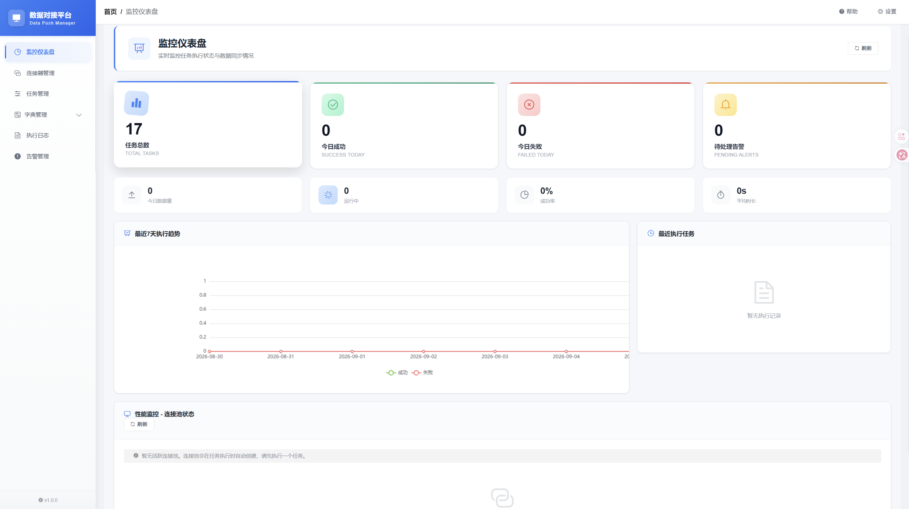
</p>

- **八大核心指标** — 任务总数、今日成功/失败、待处理告警、今日数据量、运行中、成功率、平均时长
- **执行趋势** — 最近 7 天成功/失败趋势折线图
- **性能监控** — 连接池状态实时展示，及时发现资源瓶颈

#### 2️⃣ 连接器管理

统一管理源端与目标端连接器，支持卡片/表格双视图切换。

<p align="center">
  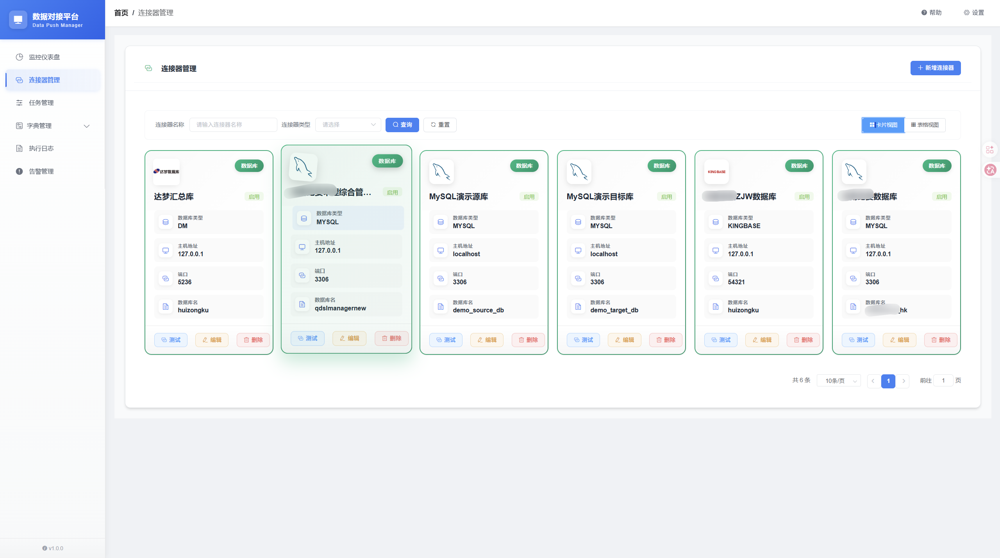
</p>

- **多数据库支持** — MySQL、达梦（DM）、人大金仓（Kingbase）、Oracle、PostgreSQL、SQL Server
- **卡片视图** — 直观展示数据库类型图标、主机地址、端口、库名
- **一键测试** — 保存前可快速验证连接可用性

#### 3️⃣ 任务管理（核心模块）⭐

任务管理是平台的核心入口，支持任务的全生命周期操作：创建、配置、调度、执行、监控。提供**向导创建**与**从模板创建**两种任务构建方式。

<p align="center">
  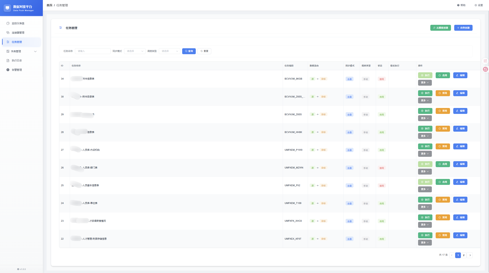
</p>

- **条件筛选** — 按任务名称、同步模式、调度类型快速检索任务
- **一键操作** — 执行、启用/禁用调度、编辑任务，更多操作下拉展开
- **数据流向** — 直观展示每个任务的“源 → 目”同步方向

**⭐ 任务向导 · 8 步完整配置流程**

点击“向导创建”或“编辑”进入任务向导，从基本信息到最终保存共 8 步，每步均有可视化配置与即时校验：

**Step 1 — 基本信息**

<p align="center">
  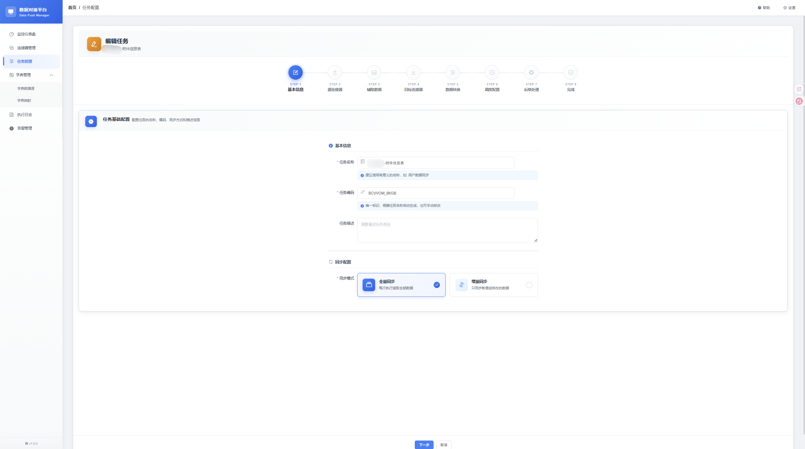
</p>

- **任务名称 / 描述** — 任务编码自动生成，无需手动填写
- **同步模式** — 全量同步 / 增量同步一键切换

**Step 2 — 源连接器（SQL 抽取）**

内置 CodeMirror SQL 编辑器，编写数据抽取语句，支持语法校验与数据预览。

<p align="center">
  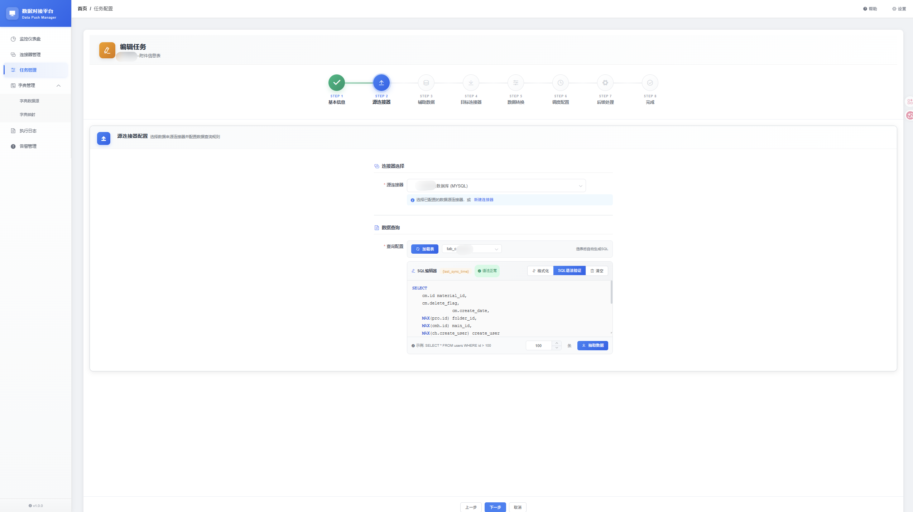
</p>

- **快捷选表** — 下拉选表自动生成基础 SQL，多表 LEFT JOIN / GROUP BY 自由编写
- **SQL 语法验证** — 一键校验语法正确性，实时反馈“语法正常”
- **可控抽取** — 抽取条数可限制（如 100 条），先预览验证再全量执行

**Step 3 — 辅助数据（多表关联）**

<p align="center">
  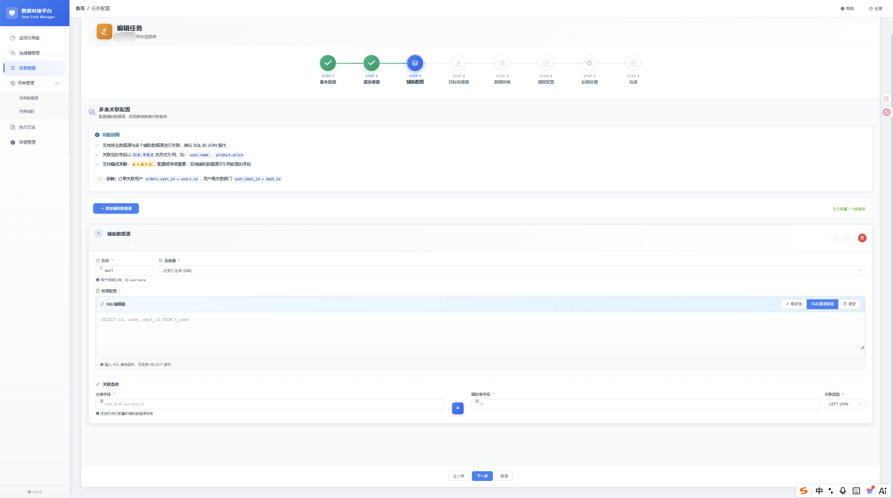
</p>

- **链式关联** — 支持 A←B←C 多表 JOIN，以“别名.字段名”方式在 SQL 中引用
- **按需配置** — 不需要关联时可跳过，直接下一步

**Step 4 — 目标连接器**

<p align="center">
  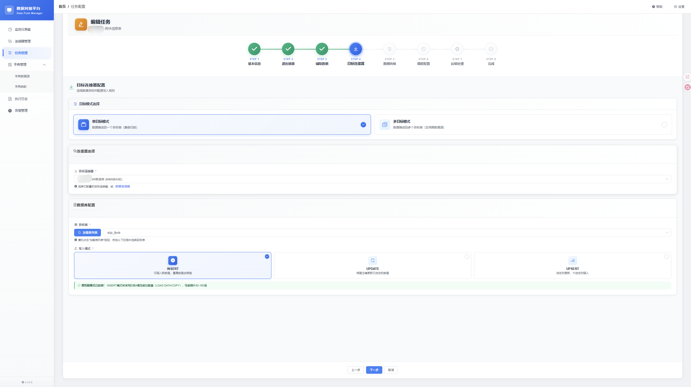
</p>

- **单目标 / 多目标** — 单源可同时推送多个目标端，按需切换
- **写入模式** — INSERT / UPDATE / UPSERT 三种写入策略
- **高性能加载器** — INSERT 模式自动启用阶段 4 高性能加载器

**Step 5 — 数据转换（核心配置）**

可视化配置源字段到目标字段的映射规则。每条规则可自由组合**空值处理 → 数据清洗 → 数据转换**三类处理器，处理顺序支持拖拽调整。

<p align="center">
  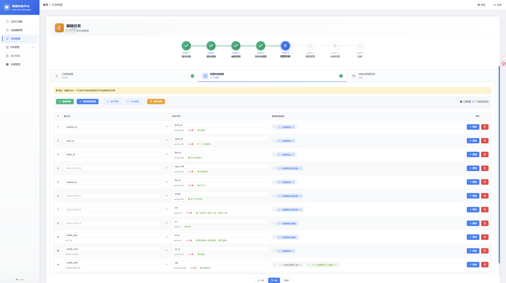
</p>

- **智能映射** — 一键自动匹配同名/同类型字段，批量规则秒级生成
- **模板复用** — 转换规则可保存为模板，同类任务直接应用
- **双视图预览** — “已抽取数据”与“转换后数据预览”实时对照，配置效果即时可见
- **可视化处理链** — “数据处理流程”列以彩色标签展示每个字段的处理器链，点击标签即可重新配置

**① 添加处理步骤 — 三类处理器总览**

<p align="center">
  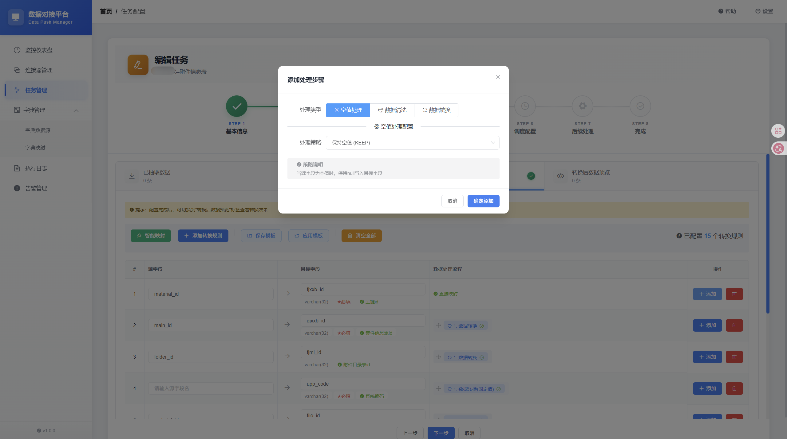
</p>

点击规则行的“添加”按钮，选择处理类型：**空值处理**、**数据清洗**或**数据转换**（同类型不可重复添加），组合成属于该字段的处理管线。

**② 空值处理**

<p align="center">
  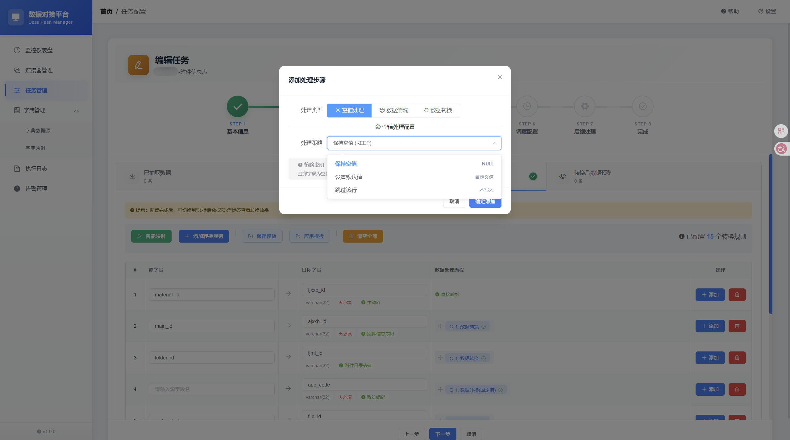
</p>

- **三种策略** — 保持空值（NULL 直接入库）/ 设置默认值 / 跳过该行（空值数据不写入）
- **动态默认值** — 默认值支持 `{CURRENT_DATE}`、`{CURRENT_DATETIME}` 占位符，自动填充当前日期/时间

**③ 数据清洗 — 插件化清洗链**

<p align="center">
  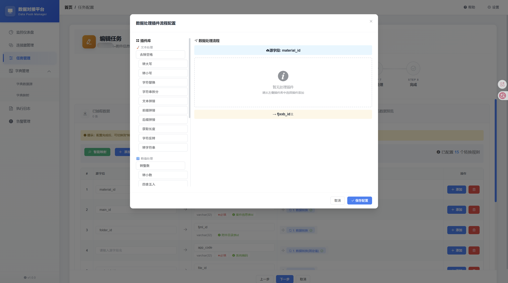
</p>

通过插件式拖拽配置构建清洗链，左侧插件库内置 **25 个清洗插件**，分四大类：

| 插件类别 | 内置插件 |
|---------|--------|
| 🧹 文本处理 | 去除空格、转大写、转小写、字符替换、字符串拆分、文本拼接、前缀/后缀拼接、获取长度、字符反转 |
| 🔢 数值处理 | 转字符串、转整数、转小数、四舍五入、向上/向下取整、绝对值、加法/乘法运算 |
| 🔐 编码转换 | URL 编码/解码、Base64 编码/解码、MD5 哈希 |
| 📅 日期处理 | 日期格式化 |

点击插件即加入右侧流程画布，卡片可上移/下移/删除，自由编排清洗顺序：

<p align="center">
  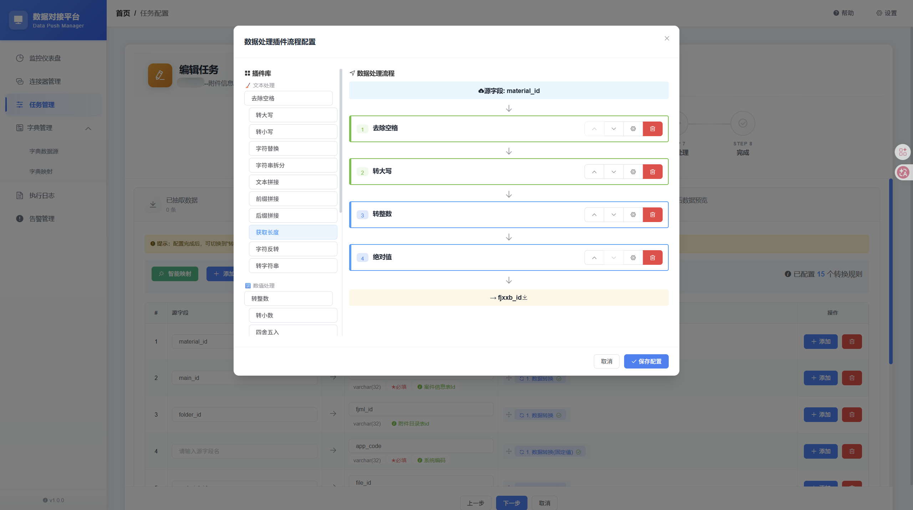
</p>

**④ 数据转换 — 四种转换类型**

<p align="center">
  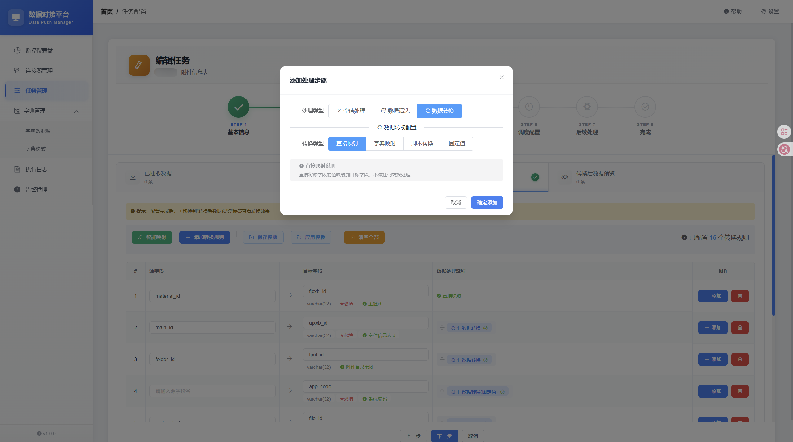
</p>

| 转换类型 | 说明 |
|---------|------|
| **直接映射** | 源字段值原样写入目标字段 |
| **字典映射** | 选择字典映射关系，支持目标编码/源名称/目标名称三种输出模式 |
| **脚本转换** | Groovy 脚本自定义逻辑，适合复杂业务规则 |
| **固定值** | 不读源字段，直接写入常量 |

其中**脚本转换**提供在线 Groovy 编辑器，可即时运行预览：

<p align="center">
  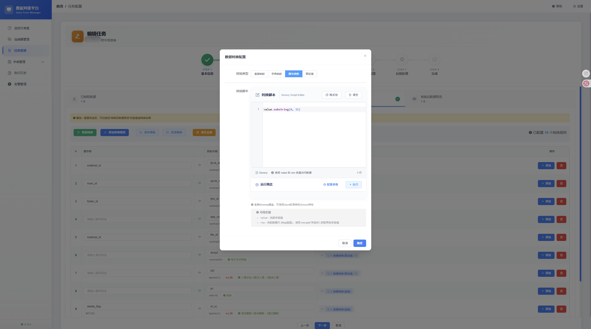
</p>

- **内置变量** — `value`（当前字段值）、`row`（当前数据行 Map，可跨字段取值）
- **在线调试** — 配置测试参数后直接执行，即时查看脚本输出结果
- **格式化支持** — 编辑器提供格式化、清空操作

**Step 6 — 调度配置**

<p align="center">
  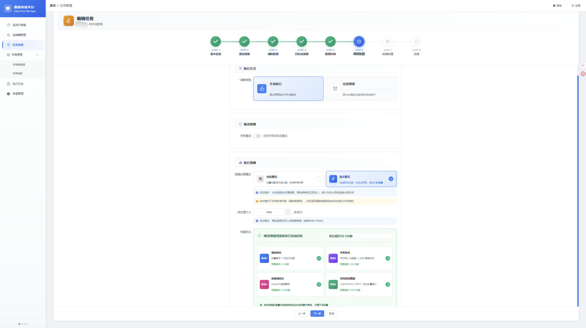
</p>

- **调度方式** — 手动执行 / Cron 定时调度，支持失败自动重试
- **执行策略** — 内存模式 / 流式模式切换，批处理大小可调（如 3000 条/批）
- **4 阶段性能优化** — 基础优化 → 并发优化 → 连接池优化 → 高性能加载器，最高提升 150 倍

**Step 7 — 后续处理**

<p align="center">
  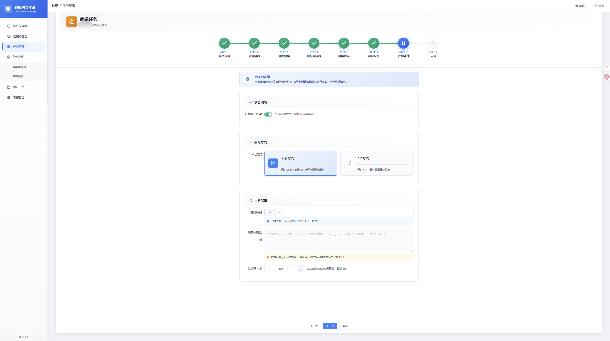
</p>

- **状态回写** — 推送成功后自动更新源端数据状态，避免重复推送
- **可选配置** — 适用于增量同步场景，全量任务可跳过

**Step 8 — 完成确认**

<p align="center">
  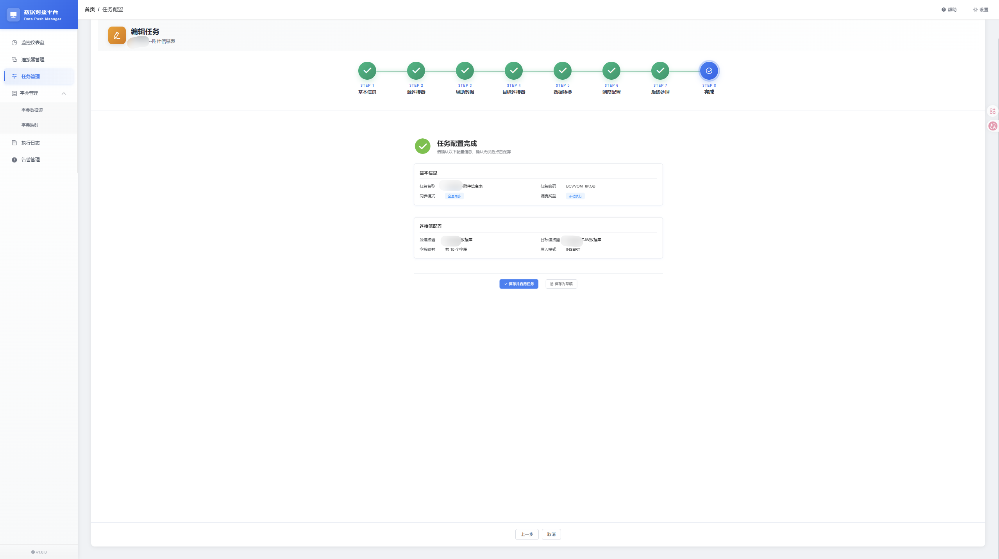
</p>

- **配置汇总** — 一页总览任务全部关键配置（连接器、映射字段数、写入模式等）
- **双保存选项** — “保存并启用任务”直接运行，或“保存为草稿”稍后完善

#### 4️⃣ 字典管理

**① 字典数据源**

接入业务系统字典表，作为字典映射的数据基础。

<p align="center">
  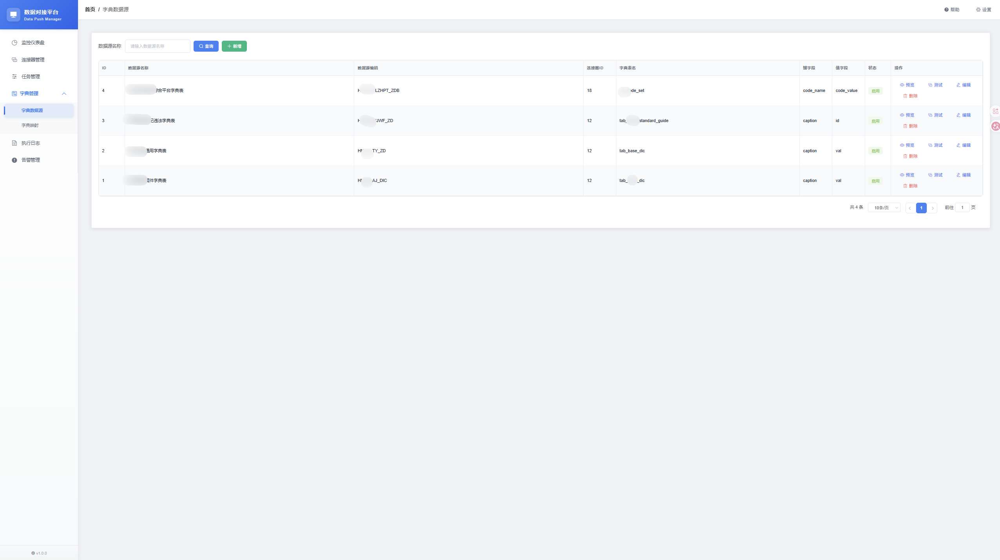
</p>

- **字典表接入** — 配置连接器、字典表名、键字段、值字段即可接入
- **预览与测试** — 保存前可预览字典数据并验证配置正确性

**② 字典映射**

配置源字典与目标字典之间的转换关系，支持四种映射类型。

<p align="center">
  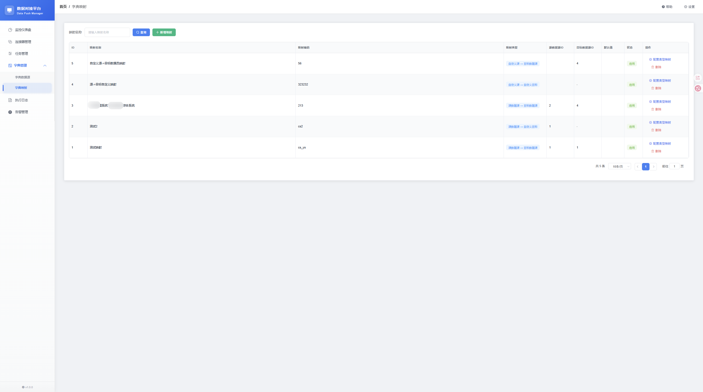
</p>

- **四种映射类型** — 源数据源→目标数据源、源数据源→自定义目标、自定义源→目标数据源、自定义源→自定义目标
- **默认值支持** — 未匹配到映射关系时可回退写入默认值

#### 5️⃣ 执行日志

完整记录每次任务执行的明细数据。

<p align="center">
  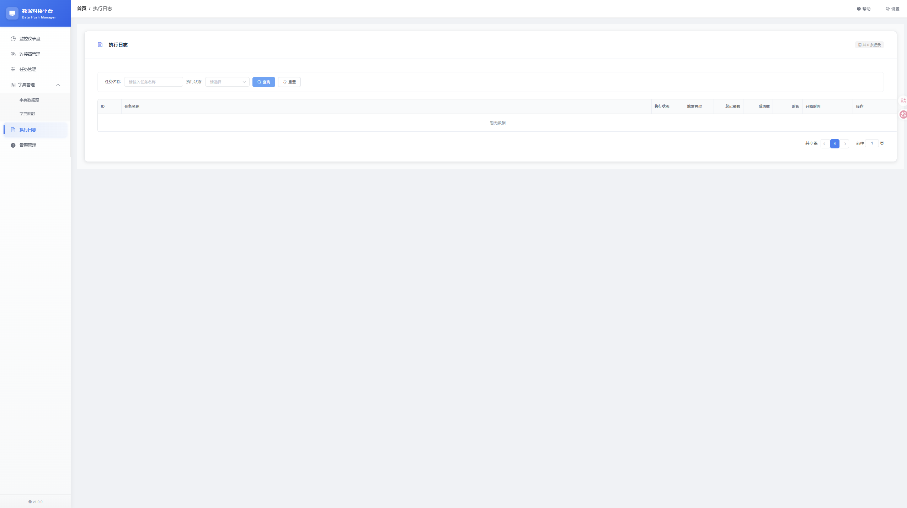
</p>

- **执行明细** — 总记录数、成功数、执行时长、触发类型、开始时间一目了然
- **状态筛选** — 按任务名称、执行状态快速定位异常记录

#### 6️⃣ 告警管理

任务失败等异常自动产生告警，集中处理。

<p align="center">
  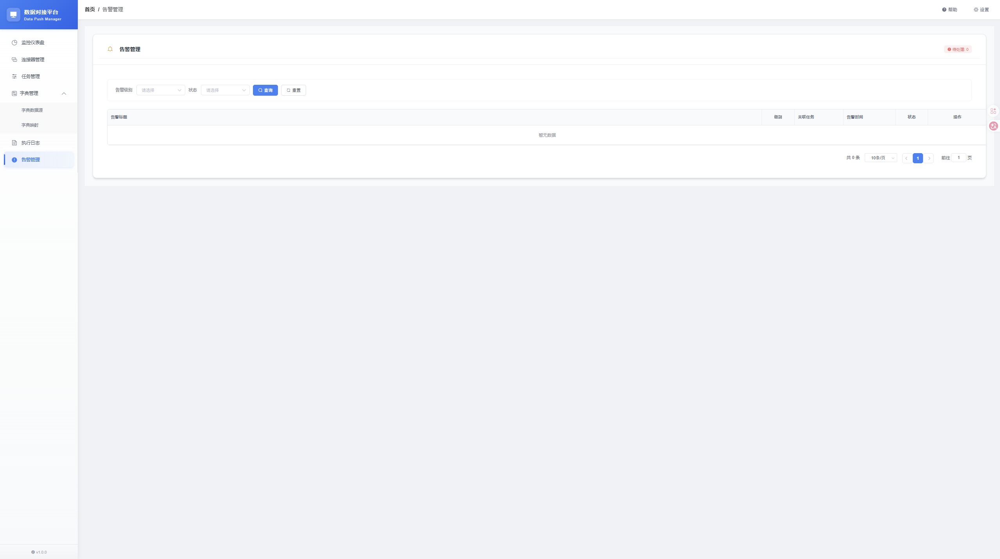
</p>

- **待处理统计** — 顶部实时展示待处理告警数量
- **级别筛选** — 按告警级别、处理状态快速过滤

#### 7️⃣ 数据血缘

追踪字段级数据流转路径，数据从哪来、到哪去、经过什么转换，清晰可见。

<p align="center">
  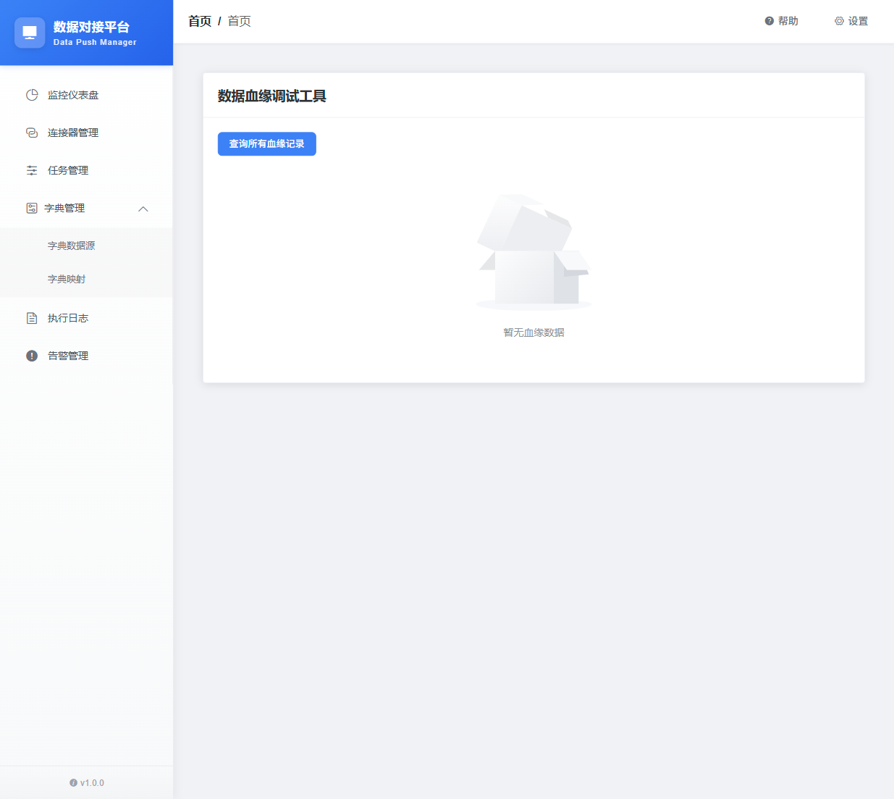
</p>

- **血缘查询** — 支持查询全量血缘记录，追踪任务执行产生的数据流转
- **下钻分析** — 结合数据对比功能，可对同步差异进行下钻定位

---

## 🏗️ 技术架构

### 系统架构图


整体架构分为四层：

- **浏览器层** — Vue 2.6 SPA，通过 Axios 调用 REST 接口
- **应用层（Spring Boot 2.2.4）** — Controller / Service / ETL Engine / Quartz 调度 / Connector Factory / 熔断器 / 监控告警 / Groovy 脚本引擎八大组件
- **元数据库** — MySQL 存储（任务配置、连接器元数据、字典、日志、监控数据），经 MyBatis-Plus + Druid 连接池访问
- **外部数据源** — Connector Factory 通过 JDBC / HTTP 动态连接 MySQL、Oracle、PostgreSQL、SQL Server、达梦、人大金仓及 HTTP API

### 技术栈明细

| 层级 | 技术 | 版本 |
|------|------|------|
| **后端框架** | Spring Boot | 2.2.4.RELEASE |
| **ORM** | MyBatis-Plus | 3.4.1 |
| **连接池** | Druid | 1.2.8 |
| **任务调度** | Spring Quartz | — |
| **脚本引擎** | Groovy | 3.0.9 |
| **工具库** | Hutool | 5.7.17 |
| **认证** | JWT (jjwt) | 0.9.1 |
| **前端框架** | Vue.js | 2.6.11 |
| **UI 组件库** | Element UI | 2.13.2 |
| **HTTP 客户端** | Axios | 0.21.1 |
| **代码编辑器** | CodeMirror | 5.65.2 |
| **图表** | ECharts | 6.0.0 |

---

## 🚀 快速开始

### 环境要求

| 依赖 | 最低版本 | 说明 |
|------|---------|------|
| JDK | 1.8+ | 推荐 Oracle JDK 或 OpenJDK |
| Maven | 3.6+ | 后端构建工具 |
| Node.js | 12.x+ | 前端构建运行时 |
| MySQL | 5.7+ | 元数据库（也支持其他关系型数据库） |

### 1. 克隆项目

```bash
git clone https://github.com/your-org/data_push_manager.git
cd data_push_manager
```

### 2. 初始化数据库

```bash
# 登录 MySQL 并执行初始化脚本
mysql -u root -p < backend/db/init.sql
```

或手动将 `backend/db/init.sql` 中的 SQL 语句在数据库客户端中执行。

### 3. 启动后端

```bash
cd backend

# 修改数据库连接配置
# 编辑 src/main/resources/application.yml
#   spring.datasource.druid.url      → 你的数据库地址
#   spring.datasource.druid.username → 你的用户名
#   spring.datasource.druid.password → 你的密码

# 编译并启动
mvn spring-boot:run
```

> 后端默认运行在 **http://localhost:8080/api**

### 4. 启动前端

```bash
cd frontend

# 安装依赖（首次运行）
npm install

# 启动开发服务器
npm run serve
```

> 前端默认运行在 **http://localhost:8081**

### 5. 生产部署

```bash
# 前端打包
cd frontend
npm run build

# 将 dist/ 目录部署到 Nginx / Tomcat 等 Web 服务器
# 修改 dist/config.js 中的 baseURL 指向后端实际地址
```

```javascript
// dist/config.js — 打包后可直接修改，无需重新构建
window.API_CONFIG = {
  baseURL: 'http://your-server:8080/api'
}
```

---

## 📡 API 文档

所有 REST API 均以 `/api/v1` 为前缀，主要端点概览：

| 模块 | 路径前缀 | 说明 |
|------|---------|------|
| 任务管理 | `/v1/task` | 任务 CRUD、执行、调度、字段映射 |
| 连接器管理 | `/v1/connector` | 连接器 CRUD、连接测试 |
| 字典管理 | `/v1/dict-source` | 字典类型与字典项管理 |
| 字典映射 | `/v1/dict-mapping` | 字典映射关系配置 |
| 数据转换 | `/v1/transform` | 转换函数管理 |
| 监控仪表盘 | `/v1/dashboard` | 统计数据查询 |
| 执行日志 | `/v1/task-execute-log` | 任务执行日志查询 |
| 数据血缘 | `/v1/data-lineage` | 字段级血缘追踪 |

**快速验证示例：**

```bash
# 查询任务列表（分页）
curl -X GET "http://localhost:8080/api/v1/task/page?pageNum=1&pageSize=10"

# 查询连接器列表
curl -X GET "http://localhost:8080/api/v1/connector/list"

# 手动执行任务
curl -X POST "http://localhost:8080/api/v1/task/{taskId}/execute"

# Webhook 触发任务
curl -X POST "http://localhost:8080/api/v1/task/trigger/{taskCode}"
```

---

## 📂 项目结构

```
data_push_manager/
├── backend/                          # 后端工程
│   ├── src/main/java/com/datapush/manager/
│   │   ├── common/                   # 通用工具与常量
│   │   ├── config/                   # 配置类（CORS、Quartz 等）
│   │   ├── connector/                # 连接器抽象与实现
│   │   │   └── impl/                 # DatabaseConnector / ApiConnector
│   │   ├── controller/               # REST 控制器
│   │   ├── engine/                   # ETL 执行引擎
│   │   ├── entity/                   # 数据实体
│   │   ├── mapper/                   # MyBatis Mapper
│   │   ├── service/                  # 业务服务层
│   │   └── circuit/                  # 熔断器
│   ├── src/main/resources/
│   │   ├── application.yml           # 应用配置
│   │   └── mapper/                   # MyBatis XML 映射文件
│   ├── db/
│   │   ├── init.sql                  # 数据库初始化脚本
│   │   └── *.sql                     # 增量升级脚本
│   └── pom.xml                       # Maven 依赖管理
├── frontend/                         # 前端工程
│   ├── src/
│   │   ├── views/                    # 页面组件
│   │   │   ├── Task.vue              # 任务管理
│   │   │   ├── TaskWizard.vue        # 任务向导
│   │   │   ├── Connector.vue         # 连接器管理
│   │   │   ├── MonitorDashboard.vue  # 监控仪表盘
│   │   │   ├── AlertManagement.vue   # 告警管理
│   │   │   ├── Log.vue               # 执行日志
│   │   │   ├── DebugLineage.vue      # 数据血缘
│   │   │   └── dict/                 # 字典管理模块
│   │   ├── components/               # 公共组件
│   │   ├── router/index.js           # 路由配置
│   │   ├── App.vue                   # 根组件
│   │   └── main.js                   # 入口文件
│   ├── public/config.js              # 运行时配置（部署时可修改）
│   ├── package.json                  # NPM 依赖管理
│   └── vue.config.js                 # Vue CLI 配置
└── docs/
    └── screenshots/                  # 系统界面截图
```

---

## 🔧 使用流程

### Step 1 — 配置连接器

进入 **连接器管理** 页面，新增源端和目标端连接器，配置数据库连接信息并点击 **测试连接** 确认可用。

### Step 2 — 创建同步任务

进入**任务管理**页面，点击**向导创建**，按 8 步向导依次配置（各步骤界面详见上方“任务向导 · 8 步完整配置流程”配图）：

1. **基本信息** — 任务名称、描述，任务编码自动生成；选择同步模式（全量 / 增量）
2. **源连接器** — 选择源端连接器，编写抽取 SQL（支持语法校验与数据预览）
3. **辅助数据** — 可选，配置多表 JOIN 关联的辅助数据源
4. **目标连接器** — 单目标/多目标模式切换，配置目标表与写入模式（INSERT / UPDATE / UPSERT）
5. **数据转换** — 配置字段映射与转换规则（详见下一步）
6. **调度配置** — 手动执行或 Cron 定时调度；可配置失败重试、内存/流式模式与批处理大小
7. **后续处理** — 可选，启用状态回写，推送成功后更新源端数据状态避免重复推送
8. **完成** — 确认配置汇总，“保存并启用任务”或“保存为草稿”

> 💡 也可使用**从模板创建**，基于已有任务模板快速生成新任务。

### Step 3 — 配置数据转换规则

在向导第 5 步“数据转换”中，点击**智能映射**自动生成映射规则，或手动**添加转换规则**，每条规则可选择：

- **直接映射** — 字段值原样写入
- **固定值转换** — 写入常量值
- **函数转换** — 使用内置清洗函数链
- **脚本转换** — Groovy 自定义逻辑
- **字典映射** — 枚举值/范围值映射

### Step 4 — 执行与监控

点击 **执行** 手动运行任务，或通过 Cron 表达式设定定时调度。在 **执行日志** 和 **监控仪表盘** 中查看运行状态。

### 增量同步 SQL 示例

```sql
-- 使用 {last_sync_time} 占位符，系统自动替换为上次同步时间
SELECT * FROM users WHERE update_time > {last_sync_time}
```

### Cron 表达式速查

| 表达式 | 说明 |
|--------|------|
| `0 0 * * * ?` | 每小时 |
| `0 0 0 * * ?` | 每天凌晨 |
| `0 */5 * * * ?` | 每 5 分钟 |
| `0 0 12 * * ?` | 每天中午 12 点 |
| `0 0 0 1 * ?` | 每月 1 号 |

---

## ❓ 常见问题

<details>
<summary><strong>连接测试失败？</strong></summary>

- 确认数据库地址与端口正确
- 确认用户名密码正确
- 确认数据库服务已启动且网络可达
- 若使用私有驱动（达梦 / 金仓），确认驱动 JAR 已正确引入

</details>

<details>
<summary><strong>任务执行失败？</strong></summary>

- 查看 **执行日志** 中的错误堆栈
- 检查源端 SQL 语法是否正确
- 检查目标表是否存在且字段匹配
- 检查字段映射是否完整

</details>

<details>
<summary><strong>前端页面空白或接口 404？</strong></summary>

- 确认后端已启动且端口未被占用
- 检查 `config.js` 中 `baseURL` 是否指向正确的后端地址
- 检查浏览器控制台是否有 CORS 报错

</details>

---

## ⚠️ 注意事项

1. **敏感信息安全** — 数据库密码已自动加密存储，请勿在配置中使用明文
2. **SQL 注入防护** — 源端 SQL 请谨慎编写，避免拼接用户输入
3. **数据量控制** — 首次测试建议使用小数据量验证，通过后再全量同步
4. **增量同步** — 增量模式需在 SQL 中使用 `{last_sync_time}` 占位符
5. **定时任务** — 启用定时调度前，请先手动执行确认无误

---

## 🤝 参与贡献

欢迎提交 Issue 和 Pull Request！

1. **Fork** 本仓库
2. 创建特性分支：`git checkout -b feature/your-feature`
3. 提交变更：`git commit -m "feat: add your feature"`
4. 推送分支：`git push origin feature/your-feature`
5. 创建 **Pull Request**

### 代码规范

- 后端遵循阿里巴巴 Java 开发规范
- 前端遵循 Vue.js 官方风格指南
- 提交前请确保代码格式化并通过编译

---

## 🐛 Bug 反馈

如果你发现了 Bug 或有功能建议，请通过以下渠道反馈：

- **GitHub Issues** — [提交 Issue](https://github.com/your-org/data_push_manager/issues)
- 提交时请附上：复现步骤、错误日志、环境信息（JDK / Node / 数据库版本）

---

## 📄 许可证

本项目基于 [MIT License](LICENSE) 开源。

---

<p align="center">
  <sub>Built with ❤️ by the Data Push Team</sub>
</p>
